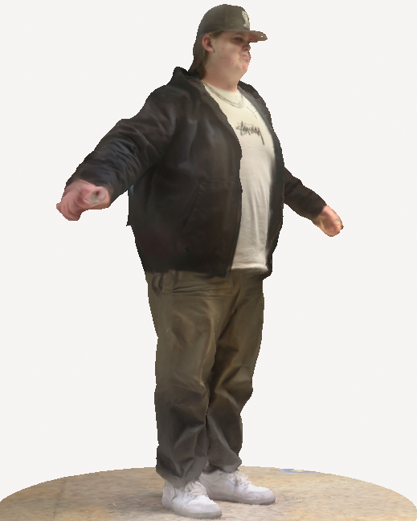

# CookieClicker Oakridge Secondary School Version

Video Game project programmed using **Raylib** and **C++**, using multithreading and efficient file storage to manage asynchronous cookie generation and save states. 

